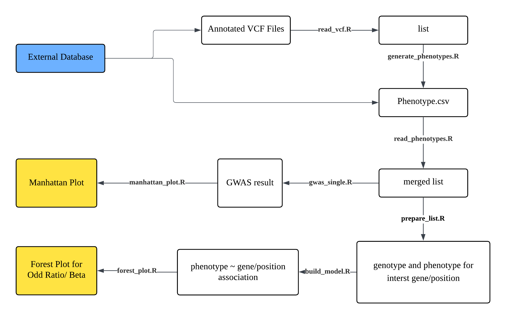

# VcfAssociation

## Description

**VcfAssociation** is an R package designed to provide an integrated
workflow for lightweight variant–phenotype association analysis.  
It demonstrates the entire GWAS process—reading, annotation, modeling,
and visualization—within one unified framework.

Unlike existing packages (e.g., **vcfR**, **VariantAnnotation**,
**qqman**), which handle isolated tasks, **VcfAssociation** integrates
all essential steps for rapid and reproducible association testing.  
This makes it ideal for teaching or small-scale exploratory projects.

The package was developed under **R version 4.5.1 (2025-06-13)** on
**macOS Tahoe 26.0** and is compatible with Windows, macOS, and Linux.

## Installation

To install the latest version of the package:

``` r
install.packages("devtools")
library(devtools)
devtools::install_github("XFF227/VcfAssociation", build_vignettes = TRUE)
library(VcfAssociation)
```

## Overview

The package provides end-to-end analysis from reading a VCF file to
visualizing GWAS results.

### User-accessible functions and their purposes

``` r
ls("package:VcfAssociation")
browseVignettes("VcfAssociation")
```

| Function | Purpose |
|----|----|
| `read_vcf()` | Read and tidy a VCF file and return a variant list and a genotype list |
| `read_phenotypes()` | Read phenotype CSV/TSV and merge with genotype data |
| `generate_phenotype()` | Create a binary phenotype for a given variant site |
| `prepare_list()` | prepare data from merged phenotype and genotype data by selecting interst variants for build_model() used |
| `build_model()` | Fit model for one variant or feature |
| `forest_plot()` | generate forest plot for variant association result visualization |
| `gwas_single()` | Perform single-variant association test |
| `manhattan_plot()` | generate manhattan plot for GWAS result visualization |

This package includes small example datasets derived from the 1000
Genomes Project for demonstration only, in inst/extdata/toy.vcf

- **Source**: 1000 Genomes Project. Publicly available data portal:
  <https://www.internationalgenome.org/data-portal/data-collection/30x-grch38>
- **Download date**: 2025-11-01
- **Subset/processing**: We extracted a small subset of samples/variants
  from chromosome 12 and performed the minimal edits to create compact
  examples for vignettes.
- **Purpose**: Educational and testing examples within `VcfAssociation`
  vignettes and unit tests; **not** intended for biological inference.
- **Redistribution**: Only the small, derived subset is redistributed
  here. For full datasets and the most up-to-date releases, please
  download directly from the 1000 Genomes Project website.

### Package Workflow Overview



------------------------------------------------------------------------

## Contributions

**Author:** Xiaofeng Li (University of Toronto)

- **Author’s Contributions:** implemented all major modules, including
  variant reading, phenotype merging, statistical analysis, and
  visualization. Write the code for all functions and their
  functionalities, along with descriptions for the devtool to compile
  into man pages. Download and process the code from the 1000 Genome
  Project to generate toy.vcf files for demonstrating and testing the
  functionality. Write a unitest for each function, debug it with AI
  assistance, and add appropriate comments for better understanding.
  Write vignettes containing the entire workflow to guide users through
  the usage process. Write this README and DESCRIPT.  
- **read_vcf()**, **read_phenotypes():** implemented using **vcfR** for
  VCF parsing and genomic data handling; combined with **dplyr** and
  **readr** for tidy data manipulation.
- **build_model():** implemented using **stats** functions (`glm()`,
  `confint()`, `qnorm()`) for logistic and linear regression modeling.
- **prepare_list():** implemented with base R operations to structure
  phenotype–variant data into a list format compatible with model
  building.
- **gwas_single():** implemented using **stats::glm()** for association
  testing and **dplyr** for data wrangling.
- **manhattan_plot()**, **forest_plot():** implemented with **ggplot2**
  for visualization and **dplyr** for summarizing model outputs.
- **generate_phenotypes():** implemented with **readr** for writing
  phenotype tables and **stats::setNames()** for column naming.
- **Data preparation:** example datasets toy.vcf were created for
  vignette demonstrations and workflow testing.
- **devtools** is used for generate document structure
- **AI tools used:** ChatGPT (OpenAI GPT-5, 2025) assisted with
  documentation structure, understanding external package usage, and
  README text formatting. It also be used when implement function
  read_vcf() for debugging and understand external package usage. It be
  used for generate some comments within the function help other people
  to know the logic.

------------------------------------------------------------------------

## References

- **1000 Genome Project**: Auton A, et al. *A global reference for human
  genetic variation.* **Nature**. 2015;526:68–74.
  <doi:10.1038/nature15393>.

- **vcfR**: Knaus, Brian J.; Grünwald, Niklaus J. (2017). vcfR: a
  package to manipulate and visualize variant call format data in R.
  Molecular Ecology Resources 17(1): 44-53.
  <http://dx.doi.org/10.1111/1755-0998.12549>

- **dplyr**: Wickham, H., François, R., Henry, L., & Müller, K. (2023).
  *dplyr: A Grammar of Data Manipulation.* R package version 1.x.
  <https://CRAN.R-project.org/package=dplyr>

- **ggplot2**: Wickham, H. (2016). *ggplot2: Elegant Graphics for Data
  Analysis.* Springer-Verlag New York. <https://ggplot2.tidyverse.org>

- **readr**: Wickham, H., Hester, J., & Bryan, J. (2023). *readr: Read
  Rectangular Text Data.* R package version 2.x.
  <https://CRAN.R-project.org/package=readr>

- **stats**: R Core Team. (2025). *R: A Language and Environment for
  Statistical Computing.* R Foundation for Statistical Computing,
  Vienna, Austria. <https://www.R-project.org/>

- **tools**: R Core Team. (2025). *tools: Tools for Package
  Development.* Part of base R distribution.
  <https://www.R-project.org/>

------------------------------------------------------------------------

## Acknowledgements

This package was developed as part of an assessment for the **2025
BCB410H1F: Applied Bioinformatics** course at the **University of
Toronto, Toronto, CANADA**.  
**VcfAssociation** welcomes issues, enhancement requests, and other
contributions.  
To submit an issue, please use the GitHub Issues page.
